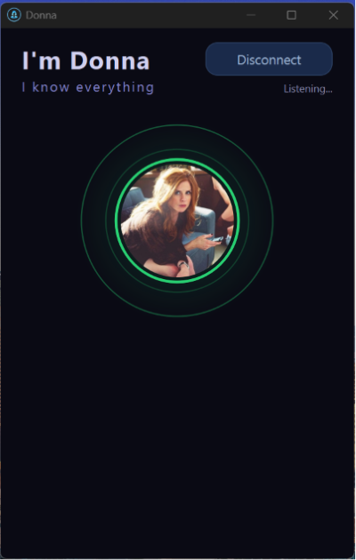
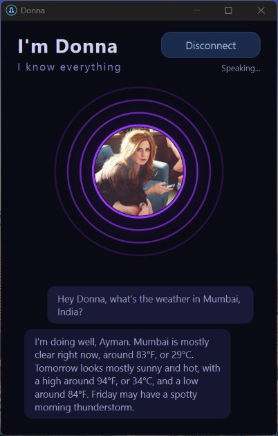

# VoiceClaw

Cross-Platform desktop voice companion for conversation with OpenClaw Agent

The MVP is local-first:

- Push-to-talk voice input.
- RealtimeSTT with faster-whisper for transcription.
- OpenClaw Gateway/WebChat WebSocket for session chat.
- RealtimeTTS with Piper for spoken replies.
- Configurable Piper executable and voice model paths.

 

## Architecture

```text
┌──────────────────────────────┐
│        PySide6 Desktop       │
│  settings, transcript, PTT   │
└───────────────┬──────────────┘
                │
                │ starts/stops workers
                ▼
┌──────────────────────────────┐        ┌──────────────────────────────┐
│       Voice Input Worker     │        │      Voice Output Worker     │
│ RealtimeSTT + faster-whisper │        │   RealtimeTTS + PiperEngine  │
│ microphone -> transcript text│        │ assistant text -> speaker    │
└───────────────┬──────────────┘        └──────────────▲───────────────┘
                │                                      │
                │ user text                            │ streamed reply text
                ▼                                      │
┌──────────────────────────────┐   WebSocket JSON-RPC  │
│    OpenClaw Gateway Client   │◄──────────────────────┘
│chat.history/send/abort/events│
└───────────────┬──────────────┘
                │
                │ ws://127.0.0.1:18789
                ▼
┌──────────────────────────────┐
│      OpenClaw Gateway        │
│existing agent + session store│
└──────────────────────────────┘
```

## Install

Install uv from [Astral UV](https://docs.astral.sh/uv/getting-started/installation/)

```powershell
uv sync
```

Start OpenClaw separately:

```powershell
openclaw gateway
```

Optionally set the Gateway token through the environment:

```powershell
cd voice-claw
Copy-Item .env.example .env # windows
cp .env.example .env # linux or macOS
```

Edit .env and set CLAW_TOKEN. The app reads .env automatically.

```powershell
uv run main.py
```

## Getting The Gateway Token

OpenClaw usually stores the Gateway token in `~/.openclaw/openclaw.json` under `gateway.auth.token`.

Fastest option:

```powershell
openclaw dashboard
```

If you do not have a token yet, generate one:

```powershell
openclaw doctor --generate-gateway-token
```

Then restart or let the Gateway reload, and paste the token into this app's `Token` field.

Alternatively, set `CLAW_TOKEN` in your shell or `.env`. The app uses `CLAW_TOKEN` automatically and it takes precedence over any token saved through the UI.

You can also inspect the config manually:

```powershell
Get-Content $HOME\.openclaw\openclaw.json # windows
cat ~\.openclaw\openclaw.json # linux or macOS
```

Look for:

```json
{
  "gateway": {
    "auth": {
      "mode": "token",
      "token": "paste-this-value-into-the-app"
    }
  }
}
```

## Personalisation

Place an image at `assets/avatar.png` (or `.jpg` / `.jpeg`) to show it inside the orb, cropped to a circle. Square source images work best. If no file is present the orb falls back to the default gradient.

## How To Use

### Setup (once per session)

1. Start the Gateway and run the app:
   
   ```powershell
   openclaw gateway
   uv run main.py
   ```
2. Click **Connect** and wait for the status bar to show `Connected`.
3. Confirm `[history loaded]` appears in the transcript.

### Each conversation turn

1. **Click the orb or press `Ctrl+Shift+Z`** — the status changes to `Listening...`.
   Wait about a second before speaking; the app clears any audio echo first.
2. **Speak your message** naturally, then stop talking.
   The app detects ~1–2 seconds of silence to know you are done, then shows `Sending...`.
3. **Wait for the reply.** Simple responses take 5–15 seconds; tool-use responses (weather, search, etc.) can take 20–40 seconds.
4. The reply appears in the transcript and is spoken aloud.
   Status returns to `Ready` when done.
5. Repeat from step 1.

### Things to avoid

- Do not click **Push To Talk** while the assistant is still speaking — the microphone will pick up Piper's audio.
- Do not click **Push To Talk** multiple times in a row — each click queues a new recording session.
- Do not close the window mid-response — click **Stop** first.

## Manual Smoke Checklist

1. Start `openclaw gateway`.
2. Confirm Gateway auth details are available if your Gateway requires a token or password.
3. Launch `uv run main.py`.
4. Click `Connect` and confirm `[history loaded]` appears in the transcript.
5. Configure Piper executable, `.onnx` voice model, and optional `.json` config path if not set in `.env`.
6. Click `Push To Talk`, wait ~1 second, speak one turn, then stop talking.
7. Confirm the transcribed text appears as a `user:` message.
8. Wait for the assistant reply to appear in the transcript and be spoken aloud.
9. Click `Stop` during a reply and confirm speech stops and the OpenClaw run aborts.
10. Start another push-to-talk turn and confirm the same session continues.

## Tests

The unit tests cover pure config, Gateway request shaping, event parsing, and sentence buffering.

```powershell
python -m unittest discover -s tests
```

## Logs

The app writes a daily log file to:

```text
logs/YYYY-MM-DD.log
```

A new file is created each day the app starts. Files older than 14 days are deleted automatically on startup. Tokens and passwords are redacted before log lines are written. If Gateway connection or message sending fails, this file is the first thing to inspect.

## Manual patches

These are fixes applied directly to venv library files. **Re-apply them after recreating the venv or upgrading the affected package.**

### RealtimeTTS — suppress Piper console windows on Windows

**File:** `.venv/Lib/site-packages/RealtimeTTS/engines/piper_engine.py`

**Problem:** `PiperEngine.synthesize` calls `subprocess.run` without `CREATE_NO_WINDOW`, so Windows flashes a console window for every sentence spoken.

**Fix:** Add `import sys` at the top of the file, then change the `subprocess.run` call in `synthesize`:

```python
creation_flags = subprocess.CREATE_NO_WINDOW if sys.platform == "win32" else 0
result = subprocess.run(
    cmd_list,
    input=text.encode("utf-8"),
    capture_output=True,
    check=True,
    shell=False,
    creationflags=creation_flags,
)
```

## Language And Speech

The app defaults STT language to `en` and wraps each voice turn with an instruction asking OpenClaw to reply in English only.

Piper speech requires a voice model:

- `Piper executable`: optional if `piper`/`piper.exe` is already on `PATH`.
- `Piper voice .onnx`: required.
- `Piper config .json`: optional; Piper can often derive it from `<voice>.onnx.json`.

### macOS Piper setup

`RealtimeTTS` defaults to looking for `piper.exe`, which does not exist on macOS. Use the `piper-tts` Python package instead:

1. Install the wheel bundled in `assets/`:

```sh
uv pip install assets/piper_tts-1.4.2-cp39-abi3-macosx_11_0_arm64.whl
```

2. Download the voice model into `models/piper/`:

```sh
mkdir -p models/piper
uv run python -m piper.download_voices --download-dir models/piper en_US-hfc_female-medium
```

3. Set the paths in `.env`:

```sh
PIPER_EXECUTABLE=/absolute/path/to/voice-claw/.venv/bin/piper
PIPER_MODEL_PATH=/absolute/path/to/voice-claw/models/piper/en_US-hfc_female-medium.onnx
```

The `.onnx.json` config is downloaded alongside the model and picked up automatically.
